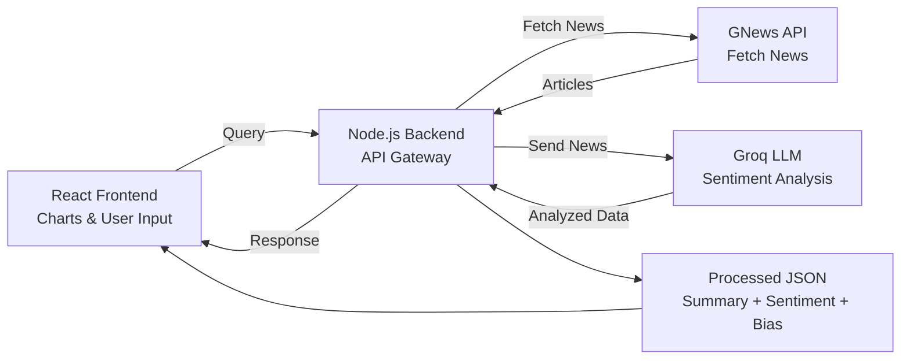

"# react-app-news-feed" 

# 🧠 AI News Sentiment Dashboard

A full-stack application that fetches real-time news, analyzes sentiment using a free LLM, and visualizes insights in an interactive React dashboard.

---

## 🚀 Overview

This system is designed to transform raw news into **actionable sentiment insights**, especially useful for financial markets (e.g., Nifty, sectors, macro trends).

### 🔄 Flow
1. User inputs query in React UI (e.g., "Nifty", "RBI", "Inflation")
2. Node.js backend fetches news from GNews API
3. News is sent to Groq LLM for analysis
4. LLM returns structured sentiment data
5. React app visualizes results (charts, graphs)

---


### 🖥️ React Frontend
- User input (search query)
- Displays:
  - 📊 Sentiment charts (Bullish / Bearish / Neutral)
  - 📈 Sector-wise impact
  - 📉 Nifty bias visualization
- Libraries:
  - Recharts / Chart.js
  - Axios

---

### ⚙️ Node.js Backend
- Acts as API gateway
- Responsibilities:
  - Accept user query
  - Fetch news from GNews
  - Send news to Groq LLM
  - Return structured sentiment data

---

### 📰 GNews API
- Fetches latest news articles
- Query-based (e.g., stock market, RBI, inflation)
- Returns:
  - Title
  - Description
  - Content
  - URL

---

### 🤖 Groq LLM
- Free LLM API (OpenAI-compatible)
- Analyzes news and returns:

```json
{
  "summary": ["..."],
  "sentiment": "Bullish",
  "sectors": ["Banking", "IT"],
  "nifty_bias": "LONG"
}

User Input (React)
        ↓
Node.js API (/news?q=...)
        ↓
Fetch from GNews
        ↓
Send to Groq LLM
        ↓
Receive structured JSON
        ↓
Return to React
        ↓
Render Charts

| Layer       | Technology          |
| ----------- | ------------------- |
| Frontend    | React.js            |
| Backend     | Node.js (Express)   |
| LLM         | Groq (Llama 3)      |
| News Source | GNews API           |
| Charts      | Recharts / Chart.js |


## 🧱 Architecture

